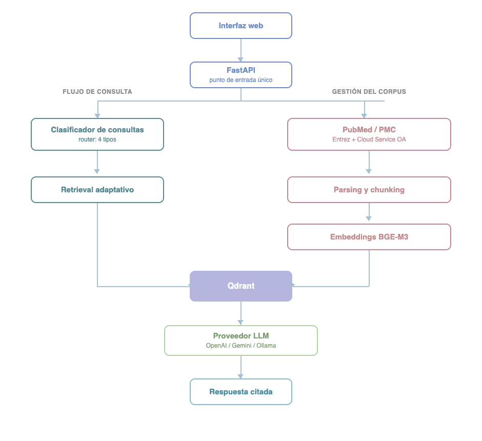
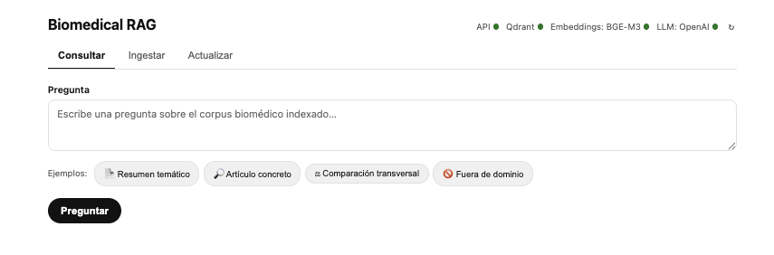
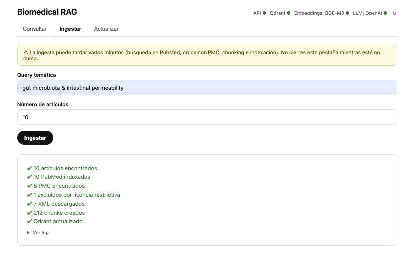

Adaptive Retrieval • PubMed • PMC • Qdrant • BGE-M3 • LangChain • FastAPI • Docker

---

# Biomedical RAG System

Biomedical RAG es un sistema RAG biomédico construido sobre PubMed y PubMed Central, capaz de clasificar automáticamente consultas científicas, recuperar evidencia mediante estrategias de retrieval adaptativo y generar respuestas fundamentadas con trazabilidad hasta los artículos originales.

---

## Índice

- [Características](#características)
- [Arquitectura general](#arquitectura-general)
- [Requisitos previos](#requisitos-previos)
- [Instalación y puesta en marcha](#instalación-y-puesta-en-marcha)
- [Ingesta de datos](#ingesta-de-datos)
- [Uso de la API](#uso-de-la-api)
- [Interfaz web](#interfaz-web)
- [Resultados](#resultados)
- [Tests](#tests)
- [Estructura del proyecto](#estructura-del-proyecto)
- [Variables de entorno](#variables-de-entorno)
- [Notas](#notas)

---

## Características

- **Retrieval adaptativo** — la estrategia de recuperación cambia según el tipo de pregunta, no una búsqueda única para todos los casos.
- **Clasificación automática de consultas** — un router distingue entre resumen temático, artículo concreto, comparación transversal y preguntas fuera de dominio.
- **Ingesta desde PubMed + PMC** — metadatos y abstracts de PubMed, texto completo estructurado por secciones desde PubMed Central.
- **Actualización incremental del corpus** — revisa altas, revisiones y retractaciones sin reprocesar la colección completa, en un job asíncrono que no bloquea la API.
- **Arquitectura multiproveedor de LLM** — OpenAI, Gemini u Ollama, intercambiables mediante una variable de entorno.
- **Embeddings BGE-M3** — modelo de embeddings ejecutado localmente, seleccionado tras una evaluación comparativa frente a modelos biomédicos especializados.
- **Respuestas fundamentadas (grounding)** — cada afirmación se cita por número de fuente; el sistema declara explícitamente cuándo la evidencia es insuficiente.
- **Despliegue en Docker** — API y base de datos vectorial contenerizadas, reproducibles con un único `docker compose up`.
- **Interfaz web** — consulta, ingesta y actualización del corpus sin necesidad de tocar la API directamente.

---

## Arquitectura general

```
Usuario → API (FastAPI)
             │
             ├─ Clasificador (LLM_PROVIDER) → tipo de query
             ├─ Retrieval (Qdrant + BGE-M3) → chunks relevantes
             └─ Generación (LLM_PROVIDER) → respuesta citada
```

El proveedor LLM (clasificador + generación) es intercambiable mediante la variable `LLM_PROVIDER` — ver `src/services/llms.py`. Soporta **OpenAI**, **Gemini** y **Ollama** (local) sin tocar el resto del pipeline.

**Componentes principales:**

| Componente | Tecnología | Dónde corre |
|---|---|---|
| Base de datos vectorial | Qdrant | Docker |
| Modelo de embeddings | BGE-M3 (`BAAI/bge-m3`) | Docker (contenedor API) |
| LLM (clasificador + generación) | OpenAI / Gemini / Ollama, según `LLM_PROVIDER` | API externa u Ollama local |
| API REST | FastAPI + LangChain | Docker |
| Fuentes de datos | PubMed / PMC (NCBI Entrez) | API pública |

<p align="center">
  
</p>

---

## Requisitos previos

### Software local
- **Docker Desktop** — necesario para levantar Qdrant y la API
  → https://www.docker.com/products/docker-desktop
- **Python 3.11+** — solo si quieres ejecutar los tests o notebooks localmente

### Credenciales (claves API)

El sistema elige el proveedor LLM mediante `LLM_PROVIDER` (`openai` | `gemini` | `ollama`, por defecto `openai`). **Solo hace falta configurar las variables del proveedor que vayas a usar** — las de los otros dos son opcionales.

| Variable | Requerida cuando | Fuente | Para qué se usa |
|---|---|---|---|
| `NCBI_API_KEY` | Siempre (recomendada) | https://www.ncbi.nlm.nih.gov/account/ | Aumenta el rate limit de PubMed de 3 a 10 req/s |
| `LLM_PROVIDER` | Siempre | — | `openai` \| `gemini` \| `ollama` (default `openai`) |
| `OPENAI_API_KEY` | `LLM_PROVIDER=openai` | https://platform.openai.com/api-keys | LLM para clasificación y generación de respuestas |
| `OPENAI_MODEL` | Opcional | — | Modelo OpenAI (default `gpt-4.1-mini`) |
| `GEMINI_API_KEY` | `LLM_PROVIDER=gemini` | https://aistudio.google.com/apikey | LLM para clasificación y generación de respuestas |
| `GEMINI_MODEL` | Opcional | — | Modelo Gemini (default `gemini-2.0-flash`) |
| `OLLAMA_BASE_URL` | `LLM_PROVIDER=ollama` | — | URL de Ollama (default `http://localhost:11434`) |
| `OLLAMA_LLM_MODEL` | Opcional | — | Modelo local servido por Ollama (default `llama3.1:8b`) |

> `GOOGLE_API_KEY` se acepta como alias heredado de `GEMINI_API_KEY` (prioridad: `GEMINI_API_KEY` primero) para proyectos que ya la tuvieran configurada. Se recomienda migrar a `GEMINI_API_KEY`.

Crea el archivo `.env` en la raíz del proyecto (puedes partir de `.env.example`), por ejemplo para usar OpenAI:

```
NCBI_API_KEY=tu_clave_ncbi
LLM_PROVIDER=openai
OPENAI_API_KEY=tu_clave_openai
```

> La `NCBI_API_KEY` es opcional pero recomendada. Sin ella el pipeline de ingesta funciona con límites más bajos.

---

## Instalación y puesta en marcha

### 1. Clonar el repositorio

```bash
git clone <url-del-repositorio>
cd project
```

### 2. Configurar el archivo `.env`

Crea el archivo `.env` en la raíz del proyecto con las claves descritas arriba.

### 3. Levantar los servicios con Docker

```bash
docker compose up --build -d
```

Esto construye la imagen de la API (incluye la descarga del modelo BGE-M3, puede tardar varios minutos la primera vez) y levanta dos contenedores:

- `qdrant_ncbi_db` — base de datos vectorial Qdrant en el puerto `6333`
- `biomedical_rag_api` — API FastAPI en el puerto `8000`

Para verificar que todo está corriendo:

```bash
docker logs biomedical_rag_api -f
```

Cuando aparezca `Application startup complete.` el sistema está listo.

### 4. Verificar el estado

```bash
curl http://localhost:8000/health
```

Respuesta esperada (con `LLM_PROVIDER=openai`):
```json
{
  "status": "ok",
  "qdrant": "ok",
  "embedding_provider": "bge-m3",
  "embedding_status": "loaded",
  "llm_provider": "openai",
  "llm_status": "configured"
}
```

`/health` comprueba tres componentes **independientes**, deliberadamente sin conflar unos con otros:

- **`qdrant`** — `ok` si `GET /healthz` responde, `unreachable (...)` si no.
- **`embedding_provider` / `embedding_status`** — BGE-M3 corre en proceso (vía `sentence-transformers`, sin red ni dependencia de Ollama). `embedding_status` es `loaded` si el modelo ya está instanciado en memoria (se carga una única vez al arrancar el proceso) o `not loaded`/`error (...)` si algo falló. **No** se recalcula un embedding real en cada petición a `/health` para mantenerlo barato — esa prueba funcional vive en `test/test_health.py`.
- **`llm_provider` / `llm_status`** — depende del proveedor activo (`LLM_PROVIDER`):
  - `openai` / `gemini` → `configured` si la API key correspondiente está presente, `misconfigured (...)` si falta.
  - `ollama` → `reachable` si responde `GET /api/tags`, `unreachable (...)` si no.

  No se hace ninguna llamada de generación (de pago) para calcular `llm_status` — solo se comprueba presencia de credenciales o, en el caso de Ollama, un ping local sin coste.

`status` es `ok` únicamente cuando Qdrant está accesible, el modelo de embeddings está cargado y el proveedor LLM activo está `configured`/`reachable`; en cualquier otro caso es `degraded`. Que Ollama esté apagado, por ejemplo, **no** afecta a `embedding_status` (los embeddings no dependen de Ollama) ni a `llm_status` si el proveedor activo es OpenAI o Gemini.

> **Cambiar de proveedor requiere reiniciar el proceso.** `LLM_PROVIDER` (y el resto de configuración del LLM) se resuelve una única vez al importar `src/services/llms.py`, al arrancar — no hay recarga en caliente. Para cambiar de proveedor en Docker:
> ```bash
> # tras editar LLM_PROVIDER (y su credencial) en .env
> docker compose up -d --force-recreate api
> ```

---

## Ingesta de datos

La colección de Qdrant empieza vacía. Hay dos formas de ingestar artículos:

### Opción A — Endpoint `/ingest` (desde la API)

```bash
curl -X POST http://localhost:8000/ingest \
  -H "Content-Type: application/json" \
  -d '{"query": "gut microbiota intestinal permeability", "n": 20}'
```

Lanza el pipeline completo: búsqueda en PubMed → cruce con PMC → chunking → indexación en Qdrant.

### Opción B — Script de test (ingesta con query predefinida)

Ejecuta el pipeline completo con una query de ejemplo sobre microbiota intestinal e indexa 10 artículos. Recrea la colección desde cero.

```bash
python test/test_indexing.py
```

> La primera vez que se ejecuta descarga el mapeo PMID→PMCID (`PMC-ids.csv.gz`, ~240 MB comprimidos) y lo guarda en `data/PMC-ids.csv` para usos posteriores. La licencia y el estado de cada artículo se consultan aparte, individualmente — ver la nota sobre PMC Open Access más abajo.

### PMC Open Access

NCBI retiró `oa_file_list.csv` del FTP Service en 2026 ([anuncio oficial](https://ncbiinsights.ncbi.nlm.nih.gov/2026/02/12/pmc-article-dataset-distribution-services/); retirada definitiva en agosto de 2026). El sistema ya no descarga ni compara ningún catálogo OA global — ver `src/data_actualization/pmc_oa_client.py`:

1. **Resolución PMID → PMCID** — vía `PMC-ids.csv.gz` (bulk, sigue vigente, no deprecado), cacheado en `data/PMC-ids.csv`.
2. **Metadata OA por artículo** (licencia, retractación, última modificación) — vía el JSON individual público del bucket S3 `pmc-oa-opendata`, accesible sin credenciales por HTTPS. Se consulta artículo a artículo, solo para los que este sistema realmente indexa — no hay catálogo global que descargar ni diferenciar.
3. **Descarga del texto completo** — sin cambios, vía E-Utilities eFetch (`src/ingest/pmc.py`); esta migración de NCBI no la afecta.

Esta separación en tres responsabilidades independientes hace que el mantenimiento del corpus (`oa_updater.run_daily_update()`) solo necesite consultar los `pmc_id` ya indexados, en vez de descargar y diferenciar un catálogo de varios cientos de MB — más ligero y más apropiado para un corpus pequeño y curado que el modelo anterior.

---

## Uso de la API

La documentación interactiva está disponible en http://localhost:8000/docs una vez levantado el sistema.

### Endpoint principal: `POST /query`

```bash
curl -X POST http://localhost:8000/query \
  -H "Content-Type: application/json" \
  -d '{"question": "What is the current evidence on gut microbiota and intestinal permeability?"}'
```

El sistema clasifica automáticamente la pregunta en uno de estos tipos:

| Tipo | Descripción | Fuente del retrieval |
|---|---|---|
| `thematic_summary` | Visión general sobre un tema | Abstracts PubMed |
| `specific_query` | Detalles de un paper concreto | Texto completo PMC |
| `transversal_query` | Mecanismo o evidencia cruzada entre papers | Texto completo PMC (MMR) |
| `none` | Fuera del dominio biomédico | — |

**Respuesta:**
```json
{
  "question": "...",
  "answer": "...",
  "query_type": "thematic_summary",
  "reason": "...",
  "pmc_id": null,
  "sources": [
    {"title": "...", "section": null, "pmc_id": "PMC...", "source": "pubmed"}
  ]
}
```

### Actualización del corpus: `GET /corpus/status`, `POST /corpus/update`, `GET /corpus/update/status`

A diferencia de `/ingest` (que amplía el corpus con artículos nuevos sobre un tema), la actualización revisa el contenido ya indexado en busca de cambios: revisiones o retiradas en PubMed, y cambios de licencia, retractaciones o exclusiones de la subcolección OA en PMC.

```bash
# Estado actual del corpus (recuentos, licencias, última actualización)
curl http://localhost:8000/corpus/status

# Lanza una actualización en segundo plano y devuelve un job_id
curl -X POST http://localhost:8000/corpus/update

# Consulta el progreso/resultado del job (pensado para polling cada 3s)
curl http://localhost:8000/corpus/update/status
```

`POST /corpus/update` no bloquea la conexión: encola el trabajo en un executor en segundo plano y responde de inmediato con `{"job_id": "...", "state": "running"}`. El progreso (fase `pubmed`/`pmc`, resultado con documentos revisados/actualizados/eliminados) se consulta sondeando `/corpus/update/status`. Una petición concurrente mientras ya hay un job en curso responde `409`; repetir la petición demasiado pronto tras la última ejecución responde `429`.

---

## Interfaz web

Además de la API, hay una interfaz de demo servida en la raíz:

http://localhost:8000/

Incluye tres pestañas:

- **Consultar** — lanza preguntas contra `/query`, con ejemplos precargados para los tres tipos de routing y las fuentes citadas en la respuesta.
- **Ingestar** — lanza ingestas de artículos nuevos contra `/ingest`.
- **Actualizar** — muestra el estado del corpus (`/corpus/status`: recuentos por fuente, desglose de licencias, última actualización) y permite lanzar una actualización (`POST /corpus/update`), con sondeo automático de progreso vía `/corpus/update/status` y un resumen del resultado al finalizar.

<p align="center">
  
</p>

<p align="center">
  
</p>

<p align="center">
  
</p>


El estado de salud del sistema puede consultarse en `/health`.

> **Limitación conocida:** `/ingest` sigue siendo síncrono y bloqueante — la petición HTTP permanece abierta durante todo el proceso de ingesta (puede tardar varios minutos). `/corpus/update` sí resuelve esta limitación mediante un job asíncrono con `job_id` y endpoint de estado; llevar `/ingest` al mismo patrón queda como trabajo futuro.


---

## Resultados

El sistema adapta automáticamente la estrategia de recuperación al tipo de consulta detectado. Dependiendo de la intención del usuario, recupera información desde los **abstracts de PubMed**, el **texto completo de PubMed Central** o realiza una búsqueda transversal sobre múltiples artículos antes de generar una respuesta fundamentada.

### Resumen temático

Para consultas generales sobre un tema biomédico, el sistema recupera los abstracts más relevantes de PubMed y genera una síntesis respaldada por las publicaciones recuperadas.

<p align="center">
  
</p>

---

### Consulta sobre un artículo concreto

Cuando la consulta hace referencia a un artículo específico (por título, autores o identificador), el sistema restringe la búsqueda al texto completo de ese trabajo en PubMed Central, permitiendo responder preguntas de detalle sobre su metodología, resultados o conclusiones.

<p align="center">
  
  
</p>

---

### Consulta transversal

Para preguntas que requieren relacionar evidencia procedente de varios artículos, el sistema realiza una búsqueda sobre todo el corpus de texto completo y recupera los fragmentos más relevantes mediante **Maximum Marginal Relevance (MMR)**, reduciendo la redundancia entre documentos.

<p align="center">
  
  
</p>

---

### Trazabilidad de las respuestas

Todas las respuestas se generan exclusivamente a partir del contexto recuperado. La interfaz permite inspeccionar los **fragmentos exactos** utilizados para fundamentar cada afirmación, proporcionando trazabilidad completa hasta la evidencia científica original.

<p align="center">
  
</p>

---

### Consultas fuera del dominio

El sistema identifica automáticamente las consultas que quedan fuera del ámbito biomédico y evita generar respuestas apoyándose en información no relacionada con el corpus científico indexado.

<p align="center">
  
</p>


---

## Tests

Instala las dependencias localmente (solo para los tests):

```bash
python -m venv .venv
source .venv/bin/activate
pip install -e .
```

Todos los tests se ejecutan desde la raíz del proyecto. Requieren que Qdrant esté corriendo (basta con `docker compose up -d qdrant`), salvo `test_api.py` que necesita la API completa.

---

### `test/test_llm_factory.py` — Selección de proveedor LLM

Verifica la lógica de `get_llm()` (`src/services/llms.py`) sin llamar a ninguna API real: construcción del cliente por proveedor, error claro cuando falta la variable requerida, independencia entre proveedores (seleccionar uno no exige la clave de otro) y el alias heredado `GOOGLE_API_KEY` para Gemini. No requiere Qdrant ni ninguna credencial real.

```bash
python test/test_llm_factory.py
```

---

### `test/test_openai_api_available.py` — Sanity check de un proveedor concreto

Comprueba que la clave del proveedor activo funciona con una llamada real mínima. Ajusta `LLM_PROVIDER`/las variables correspondientes en `.env` antes de ejecutarlo.

```bash
python test/test_openai_api_available.py
```

---

### `test/test_health.py` — Componentes de `/health` desacoplados

Verifica que Qdrant, embeddings (BGE-M3) y el proveedor LLM se reportan de forma independiente en `/health`: happy path, `status == degraded` cuando Qdrant cae (parando y reiniciando el contenedor) sin que eso afecte a `embedding_status` ni a `llm_status`, y una prueba funcional real (`encode()`) del modelo de embeddings. Requiere la API completa corriendo en Docker — para el contenedor de Qdrant usa `docker compose stop/start`, dejándolo corriendo de nuevo al terminar.

```bash
python test/test_health.py
```

---

### `test/test_indexing.py` — Ingesta de prueba

Ejecuta el pipeline completo de ingesta con una query predefinida sobre microbiota intestinal, permeabilidad e inflamación. Recrea la colección desde cero e indexa 10 artículos (abstracts PubMed + chunks PMC cuando hay texto completo disponible). Útil para verificar que todo el stack funciona correctamente tras un cambio.

```bash
python test/test_indexing.py
```

---

### `test/test_semantic_search.py` — Búsqueda semántica directa

Valida los tres patrones de retrieval directamente sobre Qdrant, sin pasar por la API ni el LLM. Ejecuta y muestra resultados para:
- **Caso 1 — Resumen temático:** búsqueda sobre abstracts PubMed (`source=pubmed`)
- **Caso 2 — Paper concreto:** búsqueda dentro de los chunks de un artículo PMC específico (`source=pmc + pmc_id`)
- **Caso 3 — Transversal:** búsqueda sobre todos los chunks PMC (`source=pmc`)
- **Diagnóstico adicional:** distribución de secciones más frecuentes en los chunks indexados

```bash
python test/test_semantic_search.py
```

---

### `test/test_api.py` — Test end-to-end de la API

Lanza 5 casos de prueba contra la API REST y muestra para cada uno el tipo de query detectado, las fuentes recuperadas y la respuesta generada por el LLM. Requiere la API corriendo en Docker.

| Caso | Query | Tipo esperado |
|---|---|---|
| 1 | Evidencia general sobre microbiota y permeabilidad | `thematic_summary` → PubMed |
| 2a | Paper concreto identificado por título | `specific_query` → PMC |
| 2b | Paper concreto identificado por autor | `specific_query` → PMC |
| 3 | Mecanismos transversales entre papers | `transversal_query` → PMC |
| OOS | Capital de Francia | `none` |

```bash
python test/test_api.py
```

Opcionalmente se puede indicar una URL distinta:

```bash
python test/test_api.py --url http://localhost:8000
```

---

### `test/test_actualizations.py` — Pipeline de actualización incremental

Ejecuta el pipeline completo de actualización:
- **PubMed** — descarga los update files diarios de NLM y aplica revisiones/borrados a los PMIDs ya indexados.
- **PMC** — consulta, artículo a artículo, la metadata OA actual de cada `pmc_id` ya indexado (licencia, retractación, última modificación — ver [PMC Open Access](#pmc-open-access) más abajo) y aplica bajas o reingestas. Nunca amplía el corpus ni descarga/compara ningún catálogo global — solo revisa lo que ya está indexado.

```bash
# Actualización completa (PubMed + PMC)
python test/test_actualizations.py

# Solo PubMed
python test/test_actualizations.py --pubmed-only

# Solo PMC
python test/test_actualizations.py --pmc-only

# Calcular cambios sin modificar Qdrant
python test/test_actualizations.py --dry-run
```

---

## Estructura del proyecto

```
project/
├── src/
│   ├── api/              # FastAPI: endpoints /health, /query, /ingest
│   ├── ingest/           # Pipeline de ingesta: PubMed, PMC, chunking, indexación
│   ├── rag/              # Chain RAG: clasificador, retrieval, prompts, estructuras
│   ├── services/         # Embeddings (BGE-M3), LLM (OpenAI/Gemini/Ollama), vector store (Qdrant)
│   ├── data_actualization/ # Actualizadores PubMed y PMC
│   └── config.py         # Configuración centralizada
├── test/                 # Tests end-to-end y unitarios
├── notebooks/            # Exploración: extracción, embeddings, actualizaciones
├── data/                 # Archivos de estado (PMC-ids.csv, last_update tracker)
├── qdrant_data/          # Volumen persistente de Qdrant (generado automáticamente)
├── qdrant_config/        # Configuración de Qdrant
├── docker-compose.yml
├── Dockerfile
└── pyproject.toml
```

---

## Variables de entorno

| Variable | Requerida | Valor por defecto | Descripción |
|---|---|---|---|
| `NCBI_API_KEY` | Recomendada | — | Clave API de NCBI para PubMed |
| `LLM_PROVIDER` | No | `openai` | Proveedor LLM activo: `openai` \| `gemini` \| `ollama` |
| `OPENAI_API_KEY` | Si `LLM_PROVIDER=openai` | — | Clave API de OpenAI |
| `OPENAI_MODEL` | No | `gpt-4.1-mini` | Modelo OpenAI |
| `GEMINI_API_KEY` | Si `LLM_PROVIDER=gemini` | — | Clave API de Google Gemini (`GOOGLE_API_KEY` como alias heredado) |
| `GEMINI_MODEL` | No | `gemini-2.0-flash` | Modelo Gemini |
| `QDRANT_URL` | No | `http://localhost:6333` | URL de Qdrant (en Docker: `http://qdrant:6333`) |
| `OLLAMA_BASE_URL` | Si `LLM_PROVIDER=ollama` | `http://localhost:11434` | URL de Ollama |
| `OLLAMA_LLM_MODEL` | No | `llama3.1:8b` | Modelo servido por Ollama |

---

## Notas

- El modelo BGE-M3 (~1.1 GB) se descarga automáticamente en el primer `docker compose up --build` y se cachea en un volumen Docker (`huggingface_cache`). Los rebuilds posteriores no lo vuelven a descargar.
- Los datos de Qdrant persisten en `./qdrant_data` aunque se reinicie o reconstruya el contenedor.
- El `Dockerfile` instala `torch` en su variante CPU-only (índice oficial de PyTorch) antes del resto de dependencias — `sentence-transformers` solo lo usa con `device="cpu"`; el wheel por defecto de PyPI en Linux arrastraría ~2 GB de librerías CUDA innecesarias.
- Para usar Ollama en local necesitas tenerlo instalado y corriendo aparte (no es un servicio de este `docker-compose.yml`); en Docker, `OLLAMA_BASE_URL` debe apuntar a `http://host.docker.internal:11434` (ya configurado así en `docker-compose.yml`) para que el contenedor alcance el Ollama del host.
